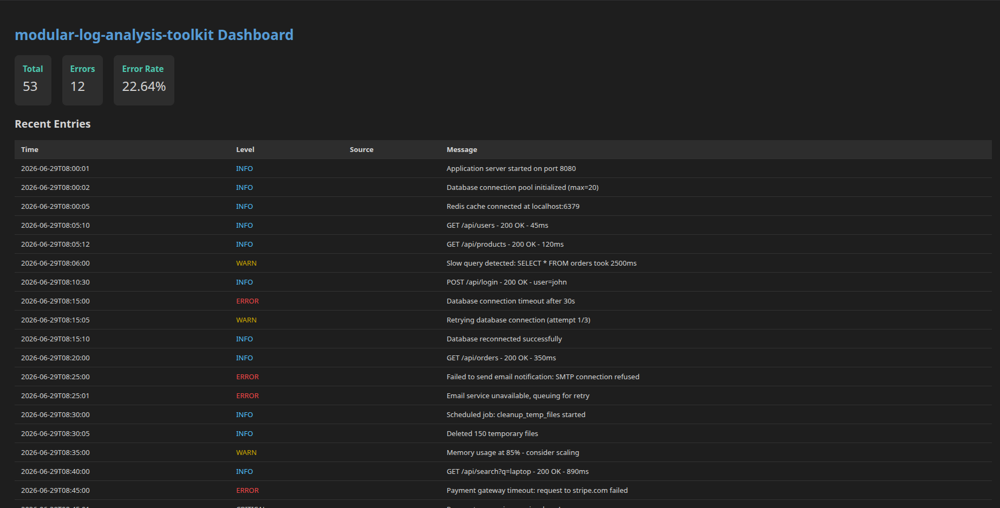
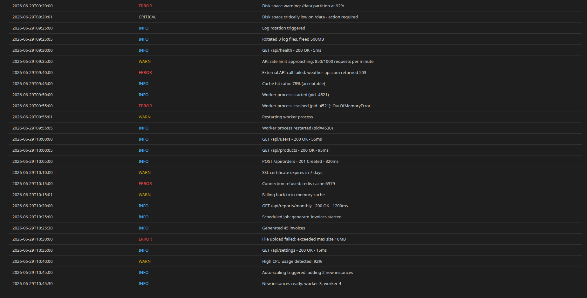

# Modular Log Analysis Toolkit

<p align="center">
  <strong>A powerful, modular log analysis toolkit built in Python</strong><br>
  Parse, filter, search, and monitor log files at scale.
</p>

<p align="center">
  
  
</p>

---

## Features

| Category | Capabilities |
|----------|-------------|
| **Parsing** | Multi-format support — standard, syslog, Apache, Nginx, custom regex |
| **Filtering** | Filter by level, time range, source, keyword, or regex pattern |
| **Analytics** | Time-window analysis, error rates, busiest hours aggregation |
| **Export** | JSON, CSV, and plain text output formats |
| **Search** | Full-text indexed search with regex support |
| **Streaming** | Memory-efficient processing for large log files |
| **Deduplication** | Hash-based duplicate detection |
| **Alerts** | Configurable thresholds — Slack, email, and webhook notifications |
| **Dashboard** | Web-based real-time monitoring with auto-refresh |
| **Plugins** | Extensible architecture for custom log processors |
| **Retention** | Automatic compression, rotation, and cleanup policies |
| **Geolocation** | Enrich network logs with IP location data |
| **Tagging** | Custom tags and labels for log categorization |
| **Auth** | Role-based access control (viewer, analyst, admin) |
| **Caching** | LRU cache for improved query performance |

---

## Project Structure

```
modular-log-analysis-toolkit/
├── src/
│   ├── __init__.py          # Package initialization
│   ├── models.py            # Data models (LogEntry, AnalysisResult)
│   ├── reader.py            # File reader utilities
│   ├── parser.py            # Log parsing engine
│   ├── filter.py            # Log filtering engine
│   ├── aggregator.py        # Statistics and aggregation
│   ├── exporter.py          # JSON/CSV/text export
│   ├── alerts.py            # Alert threshold system
│   ├── cli.py               # Command-line interface
│   ├── web.py               # Web dashboard server
│   ├── plugins.py           # Plugin system
│   ├── dedup.py             # Deduplication by hash
│   ├── streaming.py         # Streaming mode for large files
│   ├── search.py            # Full-text search indexing
│   ├── retention.py         # Log retention policies
│   ├── geolocation.py       # IP geolocation lookup
│   ├── tags.py              # Tag and label system
│   ├── webhooks.py          # Webhook notifications
│   ├── auth.py              # User authentication
│   └── cache.py             # LRU caching layer
├── tests/
│   ├── test_parser.py       # Parser unit tests
│   ├── test_filter.py       # Filter unit tests
│   └── test_aggregator.py   # Aggregator unit tests
├── docs/                    # Documentation files
├── config/
│   ├── settings.yaml        # Default configuration
│   ├── patterns.yaml        # Custom log patterns
│   └── alerts.yaml          # Alert thresholds
└── README.md
```

---

## Installation

### Recommended: Using a Virtual Environment

```bash
git clone https://github.com/ahmedmshakil/modular-log-analysis-toolkit.git
cd modular-log-analysis-toolkit

# Create and activate virtual environment
python3 -m venv venv
source venv/bin/activate        # Linux/Mac
# venv\Scripts\activate         # Windows

# Install the package
pip install -e .

# (Optional) Install extra features
pip install flask pyyaml requests geoip2
```

### Quick Install (without venv)

```bash
git clone https://github.com/ahmedmshakil/modular-log-analysis-toolkit.git
cd modular-log-analysis-toolkit
pip install -e .
```

> **Note:** A virtual environment is recommended to avoid dependency conflicts with other Python projects.

---

## Make Commands

The project includes a `Makefile` for common development tasks. First activate your venv, then use these commands:

### First Time Setup

```bash
# Create virtual environment
make venv

# Activate it
source venv/bin/activate

# Install package and dependencies
make install
```

### Available Commands

| Command           | Description                                              |
| ----------------- | -------------------------------------------------------- |
| `make help`       | Show all available make commands                         |
| `make venv`       | Create virtual environment                               |
| `make install`    | Install package in development mode                      |
| `make install-deps` | Install optional dependencies (flask, pyyaml, requests, geoip2) |
| `make test`       | Run test suite with pytest                               |
| `make lint`       | Run linter on source files                               |
| `make clean`      | Remove build artifacts and cache files                   |
| `make run`        | Run analyzer on sample log file (test.log)               |
| `make dashboard`  | Start web dashboard on port 8080                         |

### Quick Start with Make

```bash
# Full setup (first time only)
make venv && source venv/bin/activate && make install

# Create a sample log file
echo '2024-01-15 10:30:45 [ERROR] Database timeout
2024-01-15 10:31:00 [INFO] App started
2024-01-15 10:31:15 [WARN] High memory usage' > test.log

# Run analysis
make run

# Start dashboard
make dashboard
# Open http://localhost:8080 in browser

# Run tests
make test

# Clean build artifacts
make clean
```

### Important Notes

- Always activate venv before running make commands: `source venv/bin/activate`
- `make run` requires a `test.log` file in the project root
- `make dashboard` starts server on port 8080, press Ctrl+C to stop
- Run `make help` to see all available commands with descriptions

---

## Usage

### CLI

```bash
# Analyze a log file
python -m src.cli /var/log/syslog --summary

# Filter by level and export
python -m src.cli app.log -l ERROR -l CRITICAL -f json -o errors.json

# Search with keyword
python -m src.cli app.log -k "timeout" --summary
```

### Python API

```python
from src.parser import LogParser
from src.reader import read_log_lines
from src.filter import LogFilter
from src.aggregator import LogAggregator
from src.exporter import LogExporter
from src.models import LogLevel

# Parse log file
parser = LogParser(pattern_name="standard")
lines = list(read_log_lines("/var/log/app.log"))
entries = parser.parse_lines(lines)

# Filter errors
errors = LogFilter(entries).by_level(LogLevel.ERROR).apply()

# Get statistics
agg = LogAggregator(entries)
print(f"Total: {agg.summary().total_entries}")
print(f"Error rate: {agg.error_rate():.2f}%")

# Export results
LogExporter.to_json(errors, "output/errors.json")
```

### Web Dashboard

```python
from src.web import start_dashboard
from src.reader import read_log_lines
from src.parser import LogParser

parser = LogParser()
entries = parser.parse_lines(list(read_log_lines("app.log")))
start_dashboard(port=8080, entries=entries)
```

---

## Configuration

Edit `config/settings.yaml` to configure log paths, output format, retention policies, and alert thresholds.

Custom log patterns can be added to `config/patterns.yaml` using regex with named groups.

---

## Running Tests

```bash
pytest tests/
```

---

## License

MIT
